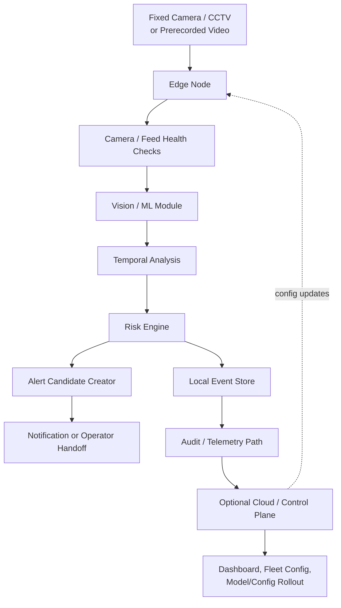

# OpenFloodAI V1 Architecture

## 1. Architecture Purpose

This document explains how the main parts of OpenFloodAI V1 fit together.

It shows:

- What each part owns.
- What data moves between parts.
- What happens when something fails.
- Where the safety boundaries are.

This is a planning document only. It does not add ML, camera, risk-engine, alerting, database, or app code.

## 2. Short Plain-Language Summary

OpenFloodAI V1 watches a fixed camera pointed at a river.

The edge node is the small computer near the camera. It checks whether the video is usable, looks for river-water changes, combines evidence over time, and creates an alert candidate when the situation may need attention.

OpenFloodAI is moving toward an edge-first camera system that watches a configured river area, measures simple water-level or water-coverage changes over time, saves clear metadata, and supports human review before any public warning action.

An alert candidate is not an official public warning. It is a “please review this” message for a human operator or approved local process.

Simple example: a camera watches a bridge. If water keeps covering more of the bridge support area for several minutes, the edge node may create an alert candidate. A human then decides what to do next.

## 3. V1 System Flow

Conceptual V1 flow:

```text
Fixed Camera / CCTV or Prerecorded Video
-> Video Stream
-> Edge Node
-> Camera Health Checks
-> Vision / ML Module
-> Water-Level or Water-Coverage Signals
-> Temporal Analysis
-> Risk Engine
-> Local Event Store
-> Alert Candidate
-> Notification or Operator Handoff
-> Optional Cloud / Control Plane
```

Core detection should continue on the edge node during cloud or internet loss when video, power, storage, and local configuration are available.

## 4. Simple Architecture Diagram

Editable diagram source: [v1-architecture.drawio](v1-architecture.drawio)



Plain-language diagram: the camera sends video to the edge node. The edge node checks if the video is usable, looks for river changes, decides a risk state, records evidence, and may create an alert candidate. Cloud tools may help with configuration, monitoring, and review, but should not be required for local detection.

## 5. Main Components and Responsibilities

### Fixed Camera or Prerecorded Video Input

What it does:

- Provides video of a fixed river scene.
- Supports prerecorded video first.
- Supports live fixed-camera streams later in V1 through a separate implementation story.

What it does not do:

- It does not decide flood risk.
- It does not create alerts.
- It does not identify people, vehicles, or license plates.

Input:

- A river scene from a camera or saved video file.

Output:

- Video frames with timestamps where available.

Failure or degraded state:

- Camera offline.
- Frozen or repeated frames.
- Blurry, dark, foggy, glared, blocked, or moved camera view.

Simple example: if the camera is covered by mud, this component should be treated as degraded instead of trusted.

### Edge Node

What it does:

- Runs near the camera on low-cost hardware where practical.
- Receives video.
- Runs health checks, vision processing, temporal analysis, and local risk assessment.
- Stores events locally.
- Keeps local configuration for offline use.
- Sends telemetry or events when network access is available.

What it does not do:

- It does not issue official evacuation warnings by itself.
- It does not require cloud access for core local detection when local inputs are healthy.

Input:

- Video frames.
- Local configuration.
- Optional model and config versions.

Output:

- Health state.
- Component signals.
- Risk state.
- Event records.
- Alert candidates.
- Telemetry when available.

Failure or degraded state:

- Low power, low disk, restart, bad clock, missing config, or unavailable local model/config.

Simple example: if internet fails but the camera and edge device still work, the edge node should keep watching and save events locally.

### Camera / Feed Health Checks

What it does:

- Checks whether video can be trusted enough for analysis.
- Detects feed loss, stale frames, poor visibility, obstruction, and major camera movement.

What it does not do:

- It does not decide flood risk alone.
- It does not hide bad video by reporting normal river conditions.

Input:

- Recent video frames and timestamps.

Output:

- Input quality state.
- Health reason codes.

Failure or degraded state:

- `UNKNOWN / DEGRADED` when the video is missing or unreliable.

Simple example: if the same image repeats for many seconds, the system should report stale frames.

### Vision / ML Module

What it does:

- Looks for water or river-region evidence in frames.
- Produces visual signals such as water coverage or visible river-region change.
- May use ML, classical vision, or both in future implementation stories.

What it does not do:

- It does not decide public warnings.
- It does not own risk-state rules.
- It does not create alert candidates directly.
- It does not identify faces, people, vehicles, or license plates.

Input:

- Usable video frames.
- Camera/site configuration.
- Model version, if a model is used.

Output:

- Water-region signal.
- Water-coverage or relative-level signal.
- Confidence or uncertainty.
- Vision reason codes.

Failure or degraded state:

- Low confidence, missing model, model load failure, unusable frame, or unsupported camera view.

Simple example: the vision module may say, “Water appears to cover more of the lower riverbank,” but it does not say, “Send an evacuation warning.”

### Temporal Analysis Module

What it does:

- Looks at evidence across many frames or time windows.
- Measures persistence and rate of change.
- Helps avoid decisions from one strange frame.

What it does not do:

- It does not decide public warnings.
- It does not replace the risk engine.

Input:

- Vision signals.
- Camera health signals.
- Timestamps.

Output:

- Evidence windows.
- Rate-of-change signals.
- Persistence signals.

Failure or degraded state:

- Not enough recent frames, dropped frames, bad timestamps, or unreliable input quality.

Simple example: one bright reflection should not change risk by itself. A sustained water rise over several minutes is stronger evidence.

### Risk Engine

What it does:

- Combines component evidence into a risk state.
- Applies persistence, hysteresis, confidence, uncertainty, and reason-code rules.
- Produces `NORMAL`, `ELEVATED`, `HIGH`, `CRITICAL`, or `UNKNOWN / DEGRADED`.
- Stays testable without the vision or ML module.

What it does not do:

- It does not run ML inference.
- It does not send public warnings.
- It does not treat ML output as ground truth.

Input:

- Water coverage or relative-level signals.
- Rate-of-change signals.
- Camera/feed health state.
- Confidence or uncertainty.
- Evidence window.
- Config version.

Output:

- Risk state.
- Reason codes.
- Risk-state transition event.
- Evidence summary.

Failure or degraded state:

- `UNKNOWN / DEGRADED` when required evidence is missing, stale, unreliable, or invalid.

Simple example: if the water signal looks high but the camera health check says the lens is blocked, the risk engine should not quietly report `NORMAL`.

### Local Event Store

What it does:

- Stores events and evidence on the edge node.
- Keeps records when the network is down.
- Supports later review and audit.

What it does not do:

- It does not decide risk.
- It does not need to store raw video by default.

Input:

- Health events.
- Component signals.
- Risk-state changes.
- Alert candidates.
- Delivery results when available.

Output:

- Local audit records.
- Uploadable event records when network access returns.

Failure or degraded state:

- Low disk, write failure, corrupt local store, or retention limit reached.

Simple example: if the internet is unavailable, the local event store keeps the “HIGH risk candidate at 14:05” record so an operator can inspect it later.

### Alert-Candidate Creator

What it does:

- Turns qualifying risk-engine output into an alert candidate.
- Adds supporting evidence and reason codes.
- Sends the candidate to a notification or operator handoff layer.

What it does not do:

- It does not create official public warnings.
- It does not bypass the risk engine.
- It does not trigger sirens, SMS blasts, or evacuation messages by itself.

Input:

- Risk state.
- Reason codes.
- Evidence window.
- Site/camera ID.
- Health state.

Output:

- Alert candidate record.

Failure or degraded state:

- Cannot create candidate, missing required fields, duplicate candidate, or invalid config.

Simple example: it may create a message saying, “Please review Camera bridge-01: HIGH risk due to fast water-coverage increase.”

### Notification or Operator Handoff Layer

What it does:

- Sends alert candidates to a person, dashboard, or configured review process.
- Records delivery attempts and results.
- Supports acknowledgement when available.

What it does not do:

- It does not become the legal public-warning authority.
- It does not change risk states.

Input:

- Alert candidate.
- Contact or routing configuration.

Output:

- Delivery attempt.
- Delivery result.
- Operator acknowledgement where available.

Failure or degraded state:

- Delivery provider unavailable, network down, bad contact config, duplicate notification, or missing acknowledgement.

Simple example: if SMS delivery fails, the system should record that failure instead of pretending the operator received the candidate.

### Optional Cloud / Control Plane

What it does:

- Manages fleet configuration when used.
- Receives telemetry and uploaded event records.
- Helps with dashboards, audit review, and model/config rollout.
- Tracks deployment health.

What it does not do:

- It does not need to be available for local core detection.
- It does not directly turn ML output into public warnings.

Input:

- Telemetry.
- Event records.
- Health heartbeats.
- Model/config metadata.

Output:

- Configuration updates.
- Model/config rollout instructions.
- Dashboards or audit views.

Failure or degraded state:

- Cloud unavailable, upload delayed, config fetch failed, dashboard unavailable, or rollout blocked.

Simple example: if the cloud dashboard is down, the edge node should keep local detection running if local resources are healthy.

### Audit / Telemetry Path

What it does:

- Moves health, event, and alert-candidate records from the edge node to review tools when possible.
- Supports traceability.

What it does not do:

- It does not require raw video upload by default.
- It does not replace local event storage.

Input:

- Local event records.
- Health heartbeat.
- Delivery results.

Output:

- Uploaded audit records.
- Monitoring data.

Failure or degraded state:

- Network loss, upload retry, delayed upload, duplicate upload, or rejected record.

Simple example: if upload fails, the edge node should retry later and keep the local record.

## 6. Edge-Node Responsibilities

The edge node owns:

- Video input from a fixed camera or prerecorded file.
- Camera/feed health checks.
- Vision or ML inference when implemented.
- Temporal analysis.
- Local risk-engine execution.
- Local event storage.
- Local configuration cache.
- Offline-safe operation.
- Health heartbeat and telemetry when network access exists.

The edge node must report a visible degraded state when it cannot trust its inputs or local environment.

## 7. Cloud / Control-Plane Responsibilities

The cloud/control plane is optional for core V1 detection.

When used, it owns:

- Fleet configuration.
- Model/config version rollout.
- Telemetry collection.
- Audit review.
- Dashboard views.
- Deployment health monitoring.

It should not be required for the edge node to process local video during a network outage.

## 8. Risk-Engine Boundary

The risk engine owns the rules for changing risk state.

It receives evidence from camera health, vision, and temporal analysis. It produces a risk state with reason codes and an evidence window.

It must be testable separately from ML. A test should be able to pass fake signals into the risk engine and check the expected state.

Simple example: a test can say, “water coverage rose fast for 6 minutes and camera health is good,” then expect `HIGH` or `CRITICAL` depending on the future configured thresholds.

## 9. ML / Vision Boundary

The ML/vision module owns visual evidence only.

It may answer questions such as:

- Where does the image look like water?
- Is water covering more of the scene than before?
- How confident is the visual signal?

It must not answer:

- Should the public evacuate?
- Should an official warning be sent?
- Is this river safe?

Simple example: the vision module can produce “water coverage increased,” while the risk engine decides what that means for the system state.

## 10. Alert-Candidate and Public-Warning Boundary

An alert candidate is a review item. It is not an official public warning.

OpenFloodAI V1 must keep these separate:

- Alert candidate: created by the system for review.
- Operator decision: made by a human or approved local process.
- Public warning: issued only by the responsible authority or approved local process.

One frame, one model, one camera, or one signal must not directly create an official public warning.

Simple example: OpenFloodAI may say, “Review this camera now.” It must not independently say, “Evacuate now.”

## 11. Event and Audit Data Flow

Events are created on the edge node.

At minimum, events and alert candidates should be traceable to:

- Site/camera ID.
- Timestamp.
- Software version.
- Model version, if a model is used.
- Config version.
- Input quality state.
- Component signals.
- Risk state.
- Reason codes.
- Evidence window.
- Alert action taken.
- Delivery result, if notification is attempted.

Data flow:

```text
Component Signals
-> Risk-State Event
-> Local Event Store
-> Alert Candidate, if needed
-> Delivery Result, if notification is attempted
-> Audit / Telemetry Upload, if network is available
```

Simple example: six months later, a maintainer should be able to ask, “Why did Camera bridge-01 create a HIGH candidate at 14:05?” and find the reason codes, software version, config version, and evidence window.

## 12. Offline and Degraded Behavior

During cloud or internet loss:

- Local detection should continue if video, power, storage, and local configuration are available.
- Events should be stored locally.
- Upload may resume after connectivity returns.
- Cloud dashboard updates may be delayed.
- Remote config changes may be delayed.

During camera feed loss:

- The system must show `UNKNOWN / DEGRADED`.
- It must not silently report `NORMAL`.
- It should record the feed-loss reason where possible.

During stale or frozen frames:

- The system must show `UNKNOWN / DEGRADED` if the stale frames make river assessment unreliable.
- It should record a stale-frame reason code.

During blurry, dark, foggy, glared, or obstructed video:

- The system should lower confidence or mark `UNKNOWN / DEGRADED`.
- It should record the input quality problem.

During low disk:

- The system should report degraded storage health.
- It should protect the most important event records where possible.
- It should avoid pretending audit storage is healthy.

During device restart:

- The system should restart monitoring when possible.
- It should record restart information if local storage is available.

During bad clock or timestamp problems:

- The system should report degraded time integrity.
- It should avoid creating misleading event timelines.

During missing or invalid local configuration:

- The system must show `UNKNOWN / DEGRADED`.
- It should not run risk decisions using unknown settings.

Simple example: if a storm knocks out the internet but the camera still works, local detection can continue. If the camera itself goes offline, the system cannot judge the river and must show degraded status.

## 13. Privacy and Security Boundaries

OpenFloodAI should collect and store only what it needs for river monitoring.

Privacy and security rules:

- Raw video retention must be configurable by site.
- The default should avoid storing raw video unless needed for review, research, or debugging.
- Camera URLs and credentials must be treated as secrets.
- Camera credentials must not be written into logs.
- Location details should be shared only with people who need them.
- Access to stored video or event evidence should be limited and auditable.
- If people, homes, roads, vehicles, or license plates appear in the scene, masking or cropping should be considered before public deployment.
- The system must not perform face recognition, person tracking, vehicle recognition, or license-plate recognition.

Simple example: if a road is visible beside the river, OpenFloodAI should not analyze license plates. The system is about river risk, not tracking people.

## 14. Component Testability Expectations

Each major component should be testable on its own.

Expected future tests:

- Camera health checks can detect stale frames, missing video, obstruction, bad visibility, and major camera movement.
- Vision outputs can be tested against known frames or replay videos.
- Temporal analysis can be tested with known time windows.
- The risk engine can be tested with fake signals and no ML model.
- The local event store can be tested for write, read, retry, and low-disk behavior.
- Alert-candidate creation can be tested for required fields, duplicate handling, and reason codes.
- Notification handoff can be tested for delivery success, delivery failure, and acknowledgement where available.
- Offline behavior can be tested by simulating network loss and recovery.

Simple example: a risk-engine unit test should not need a real camera. It should pass in example signals and check the risk state.

## 15. Known Architecture Risks

Known risks:

- A single camera can be blocked, moved, or fail.
- A single model may be wrong in rain, fog, darkness, glare, or unusual river conditions.
- Too many false alert candidates can reduce trust.
- Missed dangerous events are a critical safety risk.
- Poor timestamps can make event history misleading.
- Low-cost edge devices may struggle with performance, storage, heat, or power reliability.
- Raw video can create privacy risk if people, homes, roads, vehicles, or license plates appear in view.
- Future integrations could accidentally blur the line between alert candidate and official warning.

Mitigation direction:

- Keep degraded states visible.
- Store reason codes and evidence windows.
- Test with replay videos and failure injection.
- Keep human review in the early pilot path.
- Avoid public-warning automation until field evidence and local governance justify it.

## 16. Future Architecture Questions

Questions to answer later:

- Which low-cost edge devices are realistic for pilot sites?
- Which camera setups are good enough for reliable monitoring?
- How should each site define a normal river baseline?
- How should model, config, and code versions be signed and rolled back?
- What event retention policy works for privacy and audit needs?
- Which notification channels should early pilots use?
- How should multi-camera sites combine evidence?
- When should river gauges, rainfall data, or official hydrology data be added?
- What dashboard is needed for operators?
- What field evidence is required before moving beyond shadow or decision-support mode?

## Architect Review Notes

Reviewed conceptually using the senior flood AI architect guidance.

Architecture decisions:

- Observation, risk assessment, alert candidates, and public warnings are separated.
- The risk engine is independent from the ML/vision module.
- Edge detection is the default path for core monitoring.
- Cloud/control-plane services are optional for core detection.
- Degraded states are visible and auditable.
- Event records include versions, reason codes, and evidence windows.

Important architecture warning:

- Do not connect ML output or alert candidates directly to sirens, evacuation messages, or official public-warning channels without approved human or local governance controls.

## QA Challenge Notes

Challenged conceptually using the senior flood QA guidance.

QA concerns to test in future stories:

- Missed dangerous events must be treated as critical failures.
- False alert candidates must be measured because repeated false alerts reduce trust.
- Risk-engine behavior must be tested separately from ML behavior.
- Replay tests must cover normal water, gradual rise, rapid rise, high water, receding water, rain, fog, darkness, glare, obstruction, stale frames, and camera offline.
- Failure tests must cover network loss, cloud unavailable, low disk, bad clock, bad config, device restart, and notification failure.
- Field pilots should start in shadow or decision-support mode with documented evidence.

QA recommendation:

- This architecture is suitable as a V1 planning baseline, but not as a production-safety claim. Production readiness will require replay evidence, failure testing, edge-device validation, monitoring, and field evidence.
